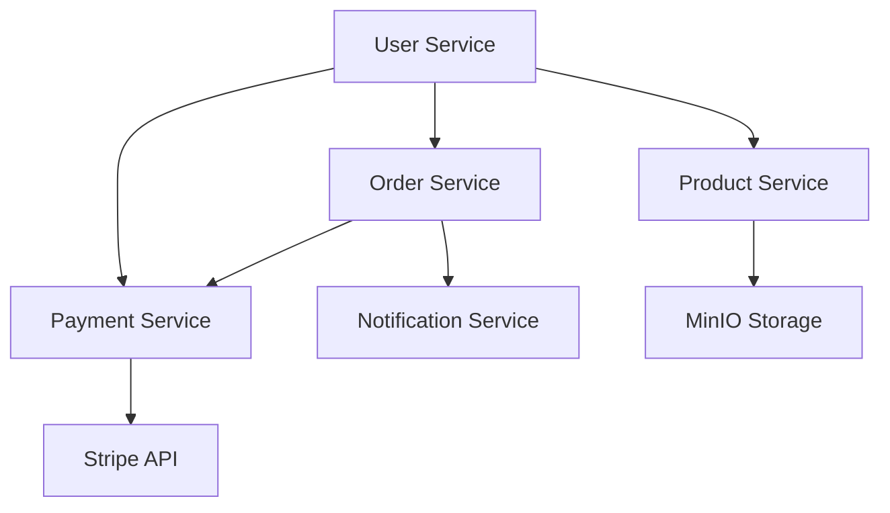

# DigitalKeyHub Platform

 <!-- Replace with your actual logo -->

A comprehensive digital marketplace platform with payment processing, user management, and product storage capabilities.

## 🚀 Features

- **Payment Processing**: Integrated with Stripe for secure transactions
- **User Management**: Complete user profiles and authentication
- **Product Storage**: MinIO-based storage solution
- **Order Management**: Full order lifecycle processing
- **Notifications**: Real-time email notifications
- **Microservices Architecture**: Modular and scalable design

## 🛠 Technologies

- **Backend**: Java 21, Spring Boot 3
- **Database**: PostgreSQL
- **Storage**: MinIO
- **Payment**: Stripe API
- **Containerization**: Docker
- **CI/CD**: GitHub Actions

## 🏗 Architecture



🚀 Getting Started
Prerequisites
Docker 20.10+

Docker Compose 2.0+

JDK 17

🐳 Running with Docker
Clone the repository:

```bash
git clone https://github.com/your-repo/digitalkeyhub.git
cd digitalkeyhub
```
Build and start containers:

```bash
docker-compose up --build -d
```

Verify services:

App: http://localhost:8080

MinIO Console: http://localhost:9001 (Login: minioadmin/minioadmin)

PostgreSQL: localhost:5432


💳 Payment Integration
To test Stripe payments locally:

Install Stripe CLI:

```bash
brew install stripe/stripe-cli/stripe  # Mac
choco install stripe-cli              # Windows
```
Forward webhooks:

``` bash
stripe listen --forward-to localhost:8080/api/payments/webhook
```
Trigger test events:
```bash
stripe trigger payment_intent.succeeded
```

🤝 Contributing
Fork the repository

Create your feature branch (git checkout -b feature/AmazingFeature)

Commit your changes (git commit -m 'Add some AmazingFeature')

Push to the branch (git push origin feature/AmazingFeature)

Open a Pull Request

📜 License
Distributed under the MIT License. See LICENSE for more information.
